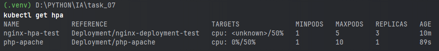

# Итоговая аттестация Задание 7. 
## Автоматическое масштабирование приложения в Minikube с использованием HPA (Horizontal Pod Autoscaler)

## Цель: 
Научиться настраивать автоматическое горизонтальное масштабирование (HPA) приложения в Minikube на основе метрик нагрузки, таких как использование процессора (CPU).

## Файлы пректа
 - В каталоге nginx располагаются необходимые файлы:
   - nginx-deployment.yaml - деплоймент, манифест создает деплоймент с 3 репликами подов, каждый из которых использует образ Nginx
   - nginx-hpa.yaml - автоматическое масштабирования подов Nginx на основе использования CPU.
 - В каталоге screenshots распологаются скриншоты выполнения задания(все они отображены в описании выполнения задания)

## Описание задания и выполнение:

### 1. Запустите Minikube, если он еще не запущен.
   1. Запуск ```minikube start``` 
     

### 2. Для тестирования масштабирования разверните простое веб-приложение, например, Nginx.
   - Создадим простой деплоймент (nginx/nginx-deployment.yaml), манифест создает деплоймент с 3 репликами подов, каждый из которых использует образ Nginx.
   - Применим nginx-deployment.yaml ```kubectl apply -f ./nginx/nginx-deployment.yaml```
   - Проверим состояние deployments ```kubectl get deployments``` 
     
   - Проверим состояние pods ```kubectl get pods``` 
     

### 3. Установите Metrics Server.
   > Чтобы использовать HPA или другие функции, которые зависят от метрик, необходимо установить Metrics Server в ваш кластер Kubernetes.

   Установка Metrics Server осуществляется следующим образом:
 
   1. Применение манифеста Metrics Server:

      ```kubectl apply -f https://github.com/kubernetes-sigs/metrics-server/releases/latest/download/components.yaml ;```

   2. Проверка установки,убедждаемся, что все поды Metrics Server запущены и работают: 

      ```kubectl get pods -n kube-system``` 
      

   3. Включим Metric Server 
       
      ```minikube addons enable metrics-server```
      
      и проверим 
      
      ```minikube addons list```
      

   4. Проверим, собираются ли метрики, с помощью команды: 
 
      ```kubectl top nodes``` 

      

      и у подов можно проверить ```kubectl top pods```

### 4. Создайте HPA для Nginx.

 > Минимальное количество подов — **1**. Максимальное — **5**. --cpu-percent=**50**.

 - Cоздадим файл nginx/nginx-hpa.yaml для автоматического масштабирования подов Nginx на основе использования CPU.
 - Применим его ```kubectl apply -f ./nginx/nginx-hpa.yaml``` 

   
 - Проверим ```kubectl get horizontalpodautoscaler```  

   

### 5. Чтобы протестировать работу HPA, создайте нагрузку на приложение.
 - Возьмем под представленный k8s 

   ```kubectl apply -f https://k8s.io/examples/application/php-apache.yaml``` 

    
 - Введем команду для создания HPA 

   ```kubectl autoscale deployment php-apache --cpu-percent=50 --min=1 --max=10```
   > --cpu-percent: Целевое значение использования CPU, при котором будет активировано масштабирование. Если среднее использование CPU превышает это значение, то количество реплик увеличивается, если падает ниже — уменьшается.   
   > 
   > --min: Минимальное количество реплик. Kubernetes не будет уменьшать количество реплик ниже этого значения, даже если нагрузка на приложение низкая.
   > 
   > --max: Максимальное количество реплик. Kubernetes не будет увеличивать количество реплик выше этого значения, даже если нагрузка на приложение высокая.
   
   

   > Предположим, у нас есть приложение на PHP и Apache, которое обрабатывает веб-запросы. При увеличении трафика на сайт может потребоваться больше подов для обработки запросов, чтобы поддерживать производительность. Команда kubectl autoscale поможет автоматически увеличить количество подов при высокой нагрузке и уменьшить их количество при снижении нагрузки, что позволяет эффективно использовать ресурсы кластера.

 - Проверим, что наш HPA развернулся ```kubectl get hpa``` 

   
   - Видим, что пока еще HPA не развернулся до конца, так как видим <unknown>. Но, пройдет некоторое время, и он развернется.
 - Отображение HPA детально 

   ```kubectl describe hpa php-apache``` 

    

### 6. Выполните команду, чтобы наблюдать за изменением количества подов в реальном времени.
 - Создаем нагрузку 

   ```kubectl run -it --rm load-generator --image=busybox /bin/sh```
   > Эта команда делает следующее:
   > 
   > kubectl run: Основная команда для запуска нового пода в Kubernetes.
   > 
   > -it: Флаги, которые означают:
   > 
   > -i: Открыть stdin (стандартный ввод) для пода, позволяя вам вводить команды.
   > 
   > -t: Открыть терминал для пода, предоставляя вам доступ к интерактивной командной строке.
   > 
   > --rm: Этот флаг указывает, что под будет автоматически удален после завершения работы. Это удобно для временных подов, которые не нужны после выполнения их задачи. Так как нагрузка у нас временная, то это самый нужный флаг.
   > 
   > load-generator: Имя пода. В данном случае, под будет называться load-generator.
   > 
   > --image=busybox: Указывает образ контейнера, который будет использоваться для создания пода. В данном случае используется образ busybox, который является легковесным Unix-подобным операционным окружением.
   > 
   > /bin/sh: Команда, которая будет выполнена в контейнере при его запуске. Здесь это интерактивная оболочка /bin/sh, которая позволяет вам вводить команды внутри контейнера.

 - Перешли внутрь пода и этот под никакую нагрузку не делает. Создадим ее командой

   ```while true; do wget -q -O- http://php-apache; done```
   > Команда посылает HTTP-запросы на адрес http://php-apache в бесконечном цикле. Каждый запрос загружает контент по указанному URL и выводит его в стандартный вывод. Поскольку используется тихий режим -q, вывод прогресса и ошибок подавляется, и вы видите только контент, возвращаемый сервером php-apache.
   > 
   > Далее начинают сыпаться OK. Любая команда будет бесполезна — потому что терминал только для вывода и поддерживает только служебные команды. 

   
 - Запускаем мониторинг 
 
   ```kubectl get hpa -w``` 
   > -w: Флаг -w означает "watch", то есть наблюдать. Он указывает kubectl следить за изменениями в реальном времени.
   - Первоначальное состояние 

     
   - После запуска нагрузки проверяем состояние: 

     
   - Проверим поды ```kubectl get pods``` 

     
     - Видим что нагрузка возрастает и количество подов (уже **5** штук) увеличивается
   - Еще раз проверяем состояние: 

     
   - Проверим поды ```kubectl get pods``` 

     
     - Видим что нагрузка возрастает и количество подов (уже **9** штук) увеличивается и нагрузка распределяется
   - Отключим "нагрузку" php-apache (на **51 мин**) и подождем

     
     - тут видим, что на **58 минуте** количество реплик **уменьшилось**, т.к. нагрузки нет, по podам тоже видим изменения  

     
     - видим что количество изменилось(уменьшилось)

## В качестве решения 
Необходимо сделать отчет, в котором видно, что количество подов увеличивается, исходя из нагрузки, а потом затухает, как только нагрузка закончилась.

  > **ВЫВОД** 
  > 
  > В полученной системе мы получили приложение, которое автоматически масштабируется при увеличении нагрузки (до указанных пределов, в конфигурации можно настраивать) - чем позволяет держать систему в работоспособном состоянии (повышая отказоустойчивость) и при снижении нагрузки позволяет высвобождать ресурсы, доводя систему до минимального работоспособного состояния, что позволяет организовывать распределение ресурсов равномерно и не затратно.

## Результат задания
После выполнения задания у вас будет развернутое в Minikube приложение, которое автоматически масштабируется в зависимости от нагрузки с помощью HPA.